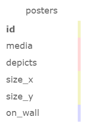

# Poster Inventory

#### By **Samantha Callie**

#### Track your posters

## Technologies Used

* HTML
* BootStrap
* C#
* .NET
* ASP.NET Core
* Razor
* SQL
* MySQL Workbench

## Description

This site allows users to fill out a form to create poster objects with various attributes. It can list these poster, and the user can click on them for details.

## Setup/Installation Requirements

1. Press the green <> Code button and select Download ZIP
2. Unzip file
3. Open your terminal (e.g., Terminal or GitBash) and navigate to this project's production directory called "PosterInventory".
4. Within that directory, create a file called `appsettings.json`
5. In `appsettings.json`, paste the following code, replacing the `uid` and `pwd` values with your own username and password for MySQL.
```json
{
  "ConnectionStrings": {
    "DefaultConnection": "Server=localhost;Port=3306;database=poster_inventory;uid=YOUR_USERNAME;pwd=YOUR_PASSWORD;"
  }
}
```
6. Open MySQL Workbench, and click on "Data Import/Restore"
7. Select "Import From Self-Contained File" and input the path (or select the three dots and navigate) to the `poster_inventory.sql` file contained in "PosterInventory.Solution"
8. Select "Dump Structure Only" and hit import.
9. In the command line, run the command `dotnet run` to compile and execute the application. Then navigate to https://localhost:5001.
10. Optionally, you can run `dotnet run --launch-profile "production"` to run in the run in production mode, as oppose to development.

## Known Bugs

* There are no known bugs at this time

## Database Schema



## License

MIT License

Copyright (c) 2024 Samantha Callie

Permission is hereby granted, free of charge, to any person obtaining a copy
of this software and associated documentation files (the "Software"), to deal
in the Software without restriction, including without limitation the rights
to use, copy, modify, merge, publish, distribute, sublicense, and/or sell
copies of the Software, and to permit persons to whom the Software is
furnished to do so, subject to the following conditions:

The above copyright notice and this permission notice shall be included in all
copies or substantial portions of the Software.

THE SOFTWARE IS PROVIDED "AS IS", WITHOUT WARRANTY OF ANY KIND, EXPRESS OR
IMPLIED, INCLUDING BUT NOT LIMITED TO THE WARRANTIES OF MERCHANTABILITY,
FITNESS FOR A PARTICULAR PURPOSE AND NONINFRINGEMENT. IN NO EVENT SHALL THE
AUTHORS OR COPYRIGHT HOLDERS BE LIABLE FOR ANY CLAIM, DAMAGES OR OTHER
LIABILITY, WHETHER IN AN ACTION OF CONTRACT, TORT OR OTHERWISE, ARISING FROM,
OUT OF OR IN CONNECTION WITH THE SOFTWARE OR THE USE OR OTHER DEALINGS IN THE
SOFTWARE.